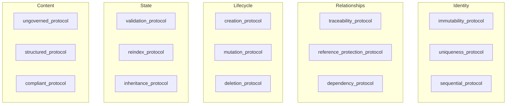

# PROTOCOLS

Atomic protocol definitions for CANONIC programming.

All protocols are AI-first (machine-parseable) but human-driven (require human decisions).

---

## Protocol Architecture



**Figure P-1: Protocol taxonomy organized by concern area.**

Protocols are atomic building blocks. Patterns compose them for common use cases.

---

## IDENTITY PROTOCOLS

Govern how entities are identified and maintained.

### immutability_protocol

**Purpose:** Field cannot change once set

**Parameters:**
- field: name of immutable field
- scope: where immutability applies

**Rules:**
- Once field is set, value cannot change
- Exception: REINDEX.md present in scope
- Violation: Field modified without REINDEX
- Action: Validation fails

**Example application:**
```
asset.id: immutability_protocol
asset.source_episode: immutability_protocol
```

---

### uniqueness_protocol

**Purpose:** Field value must be unique across collection

**Parameters:**
- field: name of unique field
- scope: collection where uniqueness applies

**Rules:**
- No two entries may have same value for field
- Violation: Duplicate value found
- Action: Validation fails

**Example application:**
```
asset.id: uniqueness_protocol (scope: LEDGER.md)
```

---

### sequential_protocol

**Purpose:** Entries follow sequential ordering

**Parameters:**
- field: field containing sequence number
- format: numbering format (e.g., NNN-, asset-NNNN)
- start: starting number (default: 1)

**Rules:**
- Sequence must be continuous (no gaps)
- Format must be consistent
- Violation: Gap in sequence or wrong format
- Action: Validation fails

**Example application:**
```
episodes: sequential_protocol (format: NNN-, field: filename)
assets: sequential_protocol (format: asset-NNNN, field: id)
```

---

## RELATIONSHIP PROTOCOLS

Govern connections between artifacts.

### traceability_protocol

**Purpose:** Field must reference existing artifact

**Parameters:**
- field: reference field name
- target: location of referenced artifacts
- format: expected reference format

**Rules:**
- Field value must point to existing artifact in target location
- Violation: Reference to non-existent artifact
- Action: Entity invalid (orphaned)

**Example application:**
```
asset.source_episode: traceability_protocol
  target: ../episodes/
  format: NNN (matches episode filename)
```

---

### reference_protection_protocol

**Purpose:** Entity cannot be deleted if referenced downstream

**Parameters:**
- entity: what's being protected
- referenced_by: locations that may reference this entity

**Rules:**
- Cannot delete entity if referenced in referenced_by locations
- Exception: REINDEX.md present in scope
- Violation: Attempt to delete referenced entity without REINDEX
- Action: Validation fails

**Example application:**
```
asset: reference_protection_protocol
  referenced_by: ../prose/*.md
```

---

### dependency_protocol

**Purpose:** Artifact depends on upstream state

**Parameters:**
- artifact: dependent artifact
- depends_on: upstream dependencies
- condition: what must be true

**Rules:**
- Artifact cannot exist/advance unless dependencies satisfied
- Violation: Dependency not met
- Action: Artifact invalid or blocked

**Example application:**
```
prose: dependency_protocol
  depends_on: [../assets/LEDGER.md, ../structure/outline.md]
  condition: both must exist
```

---

## LIFECYCLE PROTOCOLS

Govern creation, modification, deletion.

### creation_protocol

**Purpose:** Rules for creating new entities

**Parameters:**
- entity_type: what's being created
- required_fields: mandatory fields
- validation: checks before accepting

**Rules:**
- All required_fields must be provided
- Validation must pass
- Violation: Missing field or failed validation
- Action: Creation rejected

**Example application:**
```
asset: creation_protocol
  required_fields: [id, name, type, source_episode]
  validation: [id_format, type_valid, source_exists]
```

---

### mutation_protocol

**Purpose:** Rules for modifying existing entities

**Parameters:**
- entity: what can be modified
- mutable_fields: which fields can change
- immutable_fields: which cannot (uses immutability_protocol)

**Rules:**
- Only mutable_fields may be changed
- Immutable_fields follow immutability_protocol
- Violation: Attempt to change immutable field
- Action: Validation fails

**Example application:**
```
asset: mutation_protocol
  mutable_fields: [name, type, notes]
  immutable_fields: [id, source_episode]
```

---

### deletion_protocol

**Purpose:** Rules for removing entities

**Parameters:**
- entity: what can be deleted
- protection: reference_protection_protocol if applicable
- cascade: what happens to dependents

**Rules:**
- Check protection constraints first
- Handle cascade effects
- Violation: Protection constraint violated
- Action: Deletion blocked

**Example application:**
```
asset: deletion_protocol
  protection: reference_protection_protocol
  cascade: none (prose must update first)
```

---

## STATE PROTOCOLS

Govern system state and transitions.

### validation_protocol

**Purpose:** Continuous compliance checking

**Parameters:**
- scope: what's being validated
- checks: list of validation checks
- frequency: when to validate (default: on_save)

**Rules:**
- Run checks at specified frequency
- Report pass/fail with specific violations
- Block downstream on failure
- Violation: Any check fails
- Action: Specific to check

**Example application:**
```
prose: validation_protocol
  checks: [asset_references_resolve, structure_compliance]
  frequency: on_save
```

---

### reindex_protocol

**Purpose:** Controlled exception to immutability

**Parameters:**
- scope: directory where REINDEX.md applies
- suspends: which protocols are suspended
- requires: what must be documented

**Rules:**
- Create REINDEX.md in scope
- Document: reason, changes, impacts, status
- Suspended protocols inactive while REINDEX.md exists
- Output blocked while any REINDEX.md exists
- Delete REINDEX.md when complete
- Violation: Edit without REINDEX when immutability applies
- Action: Validation fails

**Example application:**
```
episodes: reindex_protocol
  suspends: immutability_protocol
  requires: [reason, changes, impacts, status]
```

---

### inheritance_protocol

**Purpose:** Child inherits parent constraints

**Parameters:**
- parent: location of parent CANON
- child: current CANON
- override_rule: what can be overridden

**Rules:**
- Child inherits all parent constraints
- Invariants cannot be overridden
- Defaults can be specialized
- Violation: Child contradicts parent invariant
- Action: Child CANON invalid

**Example application:**
```
episodes/CANON.md: inheritance_protocol
  parent: ../../CANON.md, ../CANON.md
  override_rule: defaults_only
```

---

## CONTENT PROTOCOLS

Govern artifact content structure.

### ungoverned_protocol

**Purpose:** Artifact has no content constraints

**Parameters:**
- artifact_type: what's ungoverned
- rationale: why ungoverned

**Rules:**
- No validation on content
- May be messy, incomplete, contradictory
- Other protocols still apply (naming, immutability, etc.)
- Exception: This explicitly removes content governance

**Example application:**
```
episodes: ungoverned_protocol
  rationale: Raw input captures meaning as-is
```

---

### structured_protocol

**Purpose:** Artifact must follow defined structure

**Parameters:**
- artifact: what's structured
- required_fields: mandatory structure elements
- optional_fields: allowed but not required

**Rules:**
- All required_fields must be present
- Only defined fields allowed
- Violation: Missing required or unknown field
- Action: Validation fails

**Example application:**
```
asset: structured_protocol
  required_fields: [id, name, type, source_episode]
  optional_fields: [notes]
```

---

### compliant_protocol

**Purpose:** Artifact must satisfy all applied protocols

**Parameters:**
- artifact: what must be compliant
- protocols: list of protocols to satisfy
- blocking: what's blocked on non-compliance

**Rules:**
- All specified protocols must pass
- Violation: Any protocol fails
- Action: Artifact invalid, blocking activated

**Example application:**
```
prose: compliant_protocol
  protocols: [validation_protocol, structured_protocol, dependency_protocol]
  blocking: output cannot exist
```

---

### reindex_protocol

**Purpose:** Temporarily suspend immutability for coordinated changes

**Parameters:**
- scope: directory where reindex applies
- mode: required | optional

**Procedure:**
1. Create REINDEX.md in scope:
   - reason: why change needed
   - changes: what will change
   - impacts: downstream effects
   - status: checkboxes for tracking
2. Make changes while REINDEX.md exists
3. Delete REINDEX.md when complete

**Rules:**
- While REINDEX.md exists: validation reports "REINDEX in progress"
- Output cannot exist during REINDEX
- Immutability suspended for documented changes only
- All downstream impacts must be addressed before completion

**Application modes:**
- required: Changes blocked without REINDEX (structure mutations)
- optional: REINDEX signals work-in-progress (major prose rewrites)

**Example application:**
```
structure/: reindex_protocol (mode: required)
assets/: reindex_protocol (mode: required, rare)
prose/: reindex_protocol (mode: optional)
```

---

## GOVERNANCE PROTOCOLS

Protocols for system governance and documentation.

### documentation_protocol

**Purpose:** Standardize README.md generation across CANONIC systems.

**Parameters:**
- source_canon: path to CANON.md
- source_vocabulary: path to VOCAB.md
- target_readme: path to README.md

**Generation Requirements:**
- Title must match repository purpose from CANON context
- Tagline must summarize core paradigm from VOCAB.md
- Quick Start lists: specification file, examples, related projects
- Core Idea explains paradigm vs traditional programming
- Triad Section shows file purposes with examples
- Why This Matters explains paradigm benefits
- Core Concepts defines all terms from VOCAB.md
- Examples references all example directories
- Repository Structure reflects actual directory contents
- How to Use provides learning path
- Applications lists use cases from paradigm scope

**Validation Rules:**
- All content must derive from CANON.md + VOCAB.md
- No invented content or external references
- Must be automatically generatable
- Must remain synchronized with governance changes

**Rules:**
- README.md serves as self-documenting artifact
- Content validates governance compliance
- Violation: Content not derivable from sources
- Action: Documentation invalid

**Example application:**
```
repository: documentation_protocol
  source_canon: CANON.md
  source_vocabulary: VOCAB.md
  target_readme: README.md
```

---

### mermaid_governance_protocol

**Purpose:** Ensure consistent, professional diagram appearance across CANONIC systems.

**Parameters:**
- diagram_type: flowchart | hierarchy | state
- styling: consistent theme application

**Styling Standards:**
- Direction: LR (left-to-right) for flowcharts, TB (top-bottom) for hierarchies
- Node shapes: rectangles for processes, diamonds for decisions, circles for states
- Colors: professional grays and blues only, avoid bright colors
- Labels: concise, actionable verbs, professional terminology
- Layout: logical flow, minimal crossing lines, readable

**Rules:**
- All Mermaid diagrams must follow standards
- Validation tools check compliance automatically
- Violation: Inconsistent styling or unprofessional appearance
- Action: Diagram invalid

**Example application:**
```
all_diagrams: mermaid_governance_protocol
  diagram_type: flowchart
  styling: professional_theme
```

---

### validation_protocol

**Purpose:** Implement dual validation layers for CANONIC systems.

**Parameters:**
- syntactic_checks: file existence, structure, format
- semantic_checks: constraint compliance, governance purity

**Validation Layers:**

*Syntactic Validation:*
- File existence and naming conventions
- Basic format compliance
- Triad file presence
- Internal link resolution
- Fast, cheap, structural validation

*Semantic Validation:*
- Governance purity enforcement
- Invariant compliance validation
- Terminology discipline verification
- Reference integrity beyond basic links
- Documentation purity checks

**Implementation Requirements:**
- All CANONIC systems must implement both layers
- Syntactic validation runs automatically on changes
- Semantic validation provides deeper constraint enforcement
- Both layers must pass for artifact acceptance
- Validation failures trigger backflow to source

**Rules:**
- Systems must have dual validation
- Syntactic + semantic both required
- Violation: Missing validation layer
- Action: System invalid

**Example application:**
```
canonic_system: validation_protocol
  syntactic_checks: [file_existence, format_compliance]
  semantic_checks: [constraint_compliance, governance_purity]
```

---

## Protocol Composition

Protocols are atomic. Compose them for patterns.

See WORKFLOWS.md for common compositions:
- registry_entity_pattern
- ledger_pattern
- fsm_state_pattern
- reindexable_artifact_pattern

---

## AI-First, Human-Driven

**AI-first:**
- Protocols are machine-parseable
- LLM can apply and enforce
- Validation is automated

**Human-driven:**
- Humans decide which protocols apply
- Humans create REINDEX when needed
- Humans write content (episodes, prose)
- Humans define structure (outlines, spines)

The protocols enforce what humans define.

---

End PROTOCOLS.
