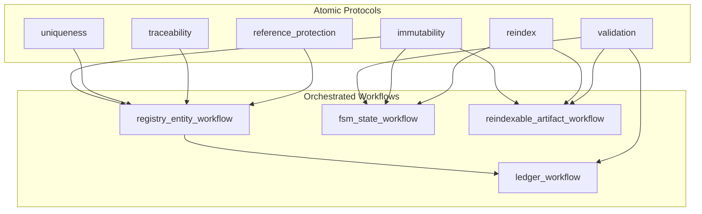
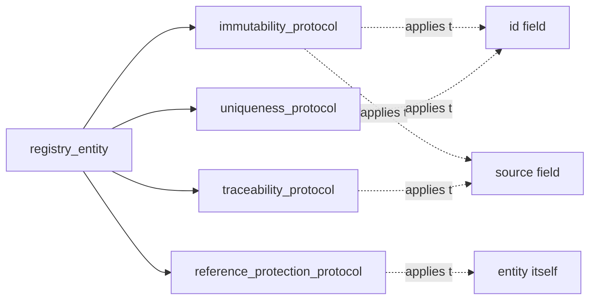
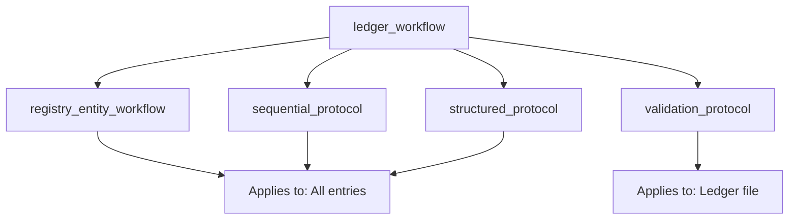
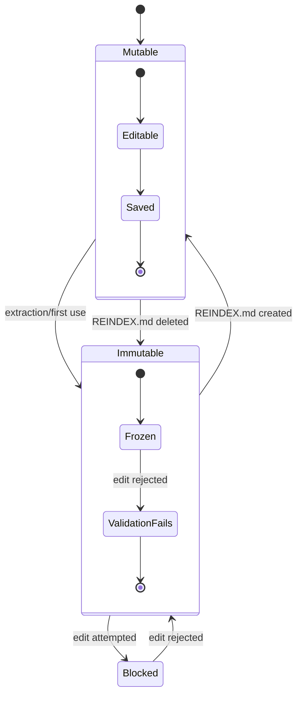
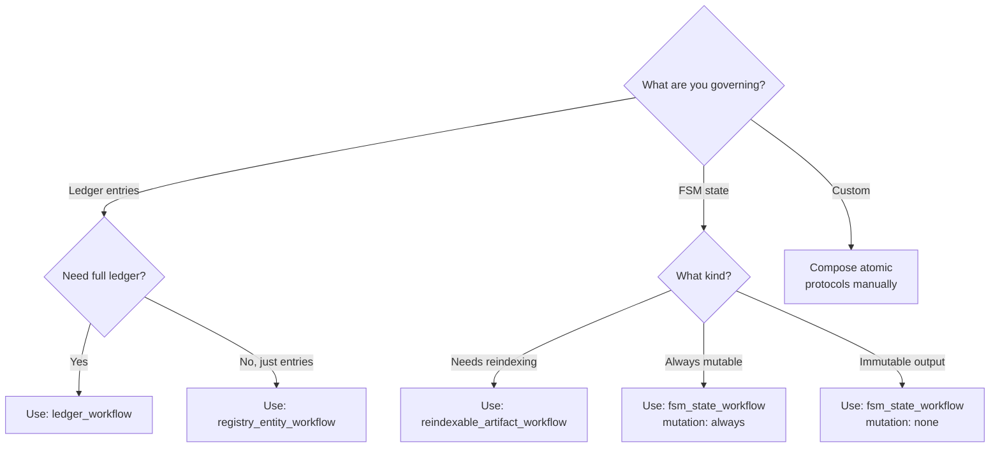

# WORKFLOWS

Orchestrated protocol compositions for common use cases.

Workflows combine atomic protocols from PROTOCOLS.md into reusable templates.

---

## Workflow Architecture



**Figure PT-1: Workflows compose atomic protocols for common scenarios.**

Each workflow provides a ready-to-use template for specific artifact types.

---

## registry_entity_workflow

**Purpose:** Standard workflow for ledger entries (assets, references, etc.)

**Composition:**



**Figure PT-2: Registry entity workflow ensures stable, traceable, protected entries.**

---

### Protocol Composition

**Applies:**
1. `immutability_protocol` on:
   - id field
   - source field

2. `uniqueness_protocol` on:
   - id field

3. `traceability_protocol` on:
   - source field → source location

4. `reference_protection_protocol` on:
   - entity (cannot delete if referenced)

---

### Usage Example

```markdown
assets/CANON.md

Asset entries use: registry_entity_workflow

Parameters:
- id field: id
- id format: asset-NNNN
- source field: source_episode
- source location: ../episodes/
- referenced_by: ../prose/
```

**This single line applies 4 protocols with specific parameters.**

---

### What It Guarantees

✓ IDs never change
✓ IDs are unique
✓ Source always traces to existing episode
✓ Cannot delete if prose references it

---

## ledger_workflow

**Purpose:** Complete workflow for registry files (LEDGER.md, indexes, catalogs)

**Composition:**



**Figure PT-3: Ledger workflow adds sequencing and structure to registry entities.**

---

### Protocol Composition

**Inherits:** `registry_entity_workflow` for all entries

**Adds:**
1. `sequential_protocol`:
   - Entries numbered sequentially
   - No gaps allowed

2. `structured_protocol`:
   - Required fields enforced
   - Optional fields allowed
   - Unknown fields rejected

3. `validation_protocol`:
   - All protocols checked on save
   - Reports violations with locations

---

### Usage Example

```markdown
assets/CANON.md

LEDGER.md uses: ledger_workflow

Entry structure:
- id: asset-NNNN (sequential, starting 0001)
- name: string
- type: person|place|object|claim|concept|event
- source_episode: NNN
- notes: string (optional)
```

---

### What It Guarantees

✓ All guarantees from registry_entity_workflow
✓ Sequential numbering (asset-0001, 0002, 0003...)
✓ Structured entries (required fields present)
✓ Continuous validation

---

## fsm_state_workflow

**Purpose:** Workflow for FSM state directories (episodes/, prose/, output/)

**Composition:**

```mermaid
stateDiagram-v2
    [*] --> State

    State --> Validation: on save
    Validation --> Valid: all checks pass
    Validation --> Invalid: checks fail

    Valid --> NextState: may advance
    Invalid --> State: must fix

    state State {
        [*] --> CheckDeps
        CheckDeps --> CheckMut
        CheckMut --> CheckReindex
        CheckReindex --> [*]
    }
```

**Figure PT-4: FSM state workflow validates dependencies, mutations, and reindex status.**

---

### Protocol Composition

**Applies:**
1. `dependency_protocol`:
   - Cannot advance without upstream satisfied
   - Example: prose needs assets + structure

2. `mutation_protocol`:
   - Defines what can/cannot change
   - Mutable vs immutable fields

3. `validation_protocol`:
   - Entry validation
   - Dependency checks
   - Mutation checks

4. `reindex_protocol` (conditional):
   - Available if state needs reindexing
   - Example: episodes after extraction

---

### Usage Example

```markdown
prose/CANON.md

Prose state uses: fsm_state_workflow

Dependencies:
- ../assets/LEDGER.md (must exist)
- ../structure/outline.md (must exist)

Mutations:
- Always mutable (prose is editable)

Validation:
- asset_references_resolve
- structure_compliance

Reindex: optional (for major rewrites)
```

---

### What It Guarantees

✓ Cannot advance without dependencies
✓ Clear mutation rules
✓ Validated on every save
✓ Reindex available when needed

---

## reindexable_artifact_workflow

**Purpose:** Artifacts that are normally immutable but can be reindexed

**Composition:**



**Figure PT-5: Reindexable artifacts toggle between mutable (REINDEX active) and immutable (normal).**

---

### Protocol Composition

**Applies:**
1. `immutability_protocol`:
   - Default state: immutable
   - Exception: REINDEX.md present

2. `reindex_protocol`:
   - Procedure for controlled mutation
   - Suspends immutability while active
   - Blocks output

3. `validation_protocol`:
   - Checks immutability (unless REINDEX)
   - Checks REINDEX documentation complete
   - Checks downstream updated after REINDEX

---

### Usage Example

```markdown
episodes/CANON.md

Episodes use: reindexable_artifact_workflow

Immutability trigger: Assets extracted from episode

Reindex requirements:
- Document reason
- List changes
- Note downstream impacts (assets, prose)
- Update status checklist

Validation:
- File naming
- Sequential numbering
- Immutability (unless REINDEX active)
```

---

### What It Guarantees

✓ Immutable by default (preserves traceability)
✓ Controlled mutation via REINDEX
✓ Output blocked during REINDEX
✓ Validated on completion

---

## Workflow Selection Guide



**Figure PT-6: Decision tree for selecting the right workflow.**

---

## Extending Workflows

Create new workflows by composing atomic protocols:

```markdown
my_custom_workflow:
  = base_workflow
  + additional_protocol_1
  + additional_protocol_2
  - removed_protocol (if overriding)
```

Example:

```markdown
versioned_ledger_workflow:
  = ledger_workflow
  + version_protocol (track ledger versions)
  + snapshot_protocol (preserve history)
```

---

## AI Interprets, Humans Decide

**AI interprets workflows:**
- Recognizes workflow names
- Applies composed protocols
- Validates according to rules

**Humans decide workflows:**
- Which workflow fits the use case
- What parameters to provide
- When to create custom workflows

Workflows make the AI's job easier while keeping humans in control.

---

End WORKFLOWS.
