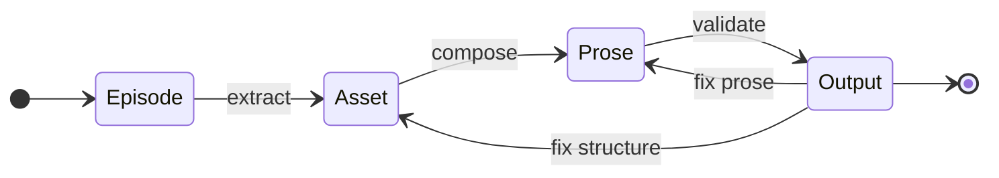

# MACHINE

**The 4-state CANONIC FSM for domain-agnostic content governance.**

This document defines the finite state machine that transforms raw domain input into validated output through governed extraction and composition.

---

## The Problem

Content systems fail when they mix concerns:

- Input and structuring happen simultaneously
- Composition and validation blur together
- Revision destroys traceability
- Rewriting risks losing meaning
- Collaboration causes drift

LLMs make this worse, not better:
- They generate fluent content that references nonexistent sources
- They invent structure that contradicts prior decisions
- They drift between iterations
- They cannot trace claims back to source material

Traditional content systems have no compiler. The CANONIC FSM fixes this.

---

## The Solution

The CANONIC FSM is a **4-state machine** with three transitions and one validation gate.



**The separation:**
- **Episodes** hold meaning (raw, ungoverned)
- **Assets** hold structure (extracted, registered)
- **Prose** holds composition (governed, traceable)
- **Output** holds validity (compliant, immutable)

Each state has CANON. Each transition has validation.

This is the entire machine.

---

## State 1: Episode

An **episode** is raw domain input.

**Domain examples:**
- **Writing:** Lived experiences, observations, memories
- **Documentation:** Requirements, specifications, stakeholder notes
- **Research:** Field observations, raw data, experimental notes
- **Knowledge:** Highlights, learnings, bookmarks, quotes

**Episodes are ungoverned.**

They are allowed to be:
- Messy
- Contradictory
- Incomplete
- Stream-of-consciousness

This is where meaning enters the system.

**Why episodes matter:**

Traditional systems start with structure. The FSM starts with source material.

You do not begin by outlining or organizing. You begin by recording what happened, what you observed, what you learned.

Episodes are the source material. Everything downstream traces back to episodes.

**Episode CANON:**

```
episodes/CANON.md

Required:
  - Filename: sequential numbering (001-, 002-, etc.)
  - Domain-sourced (human observations, not LLM-generated)

Allowed:
  - Any format: prose, bullets, fragments, lists
  - Contradictions and uncertainty
  - Incomplete thoughts

Forbidden:
  - Asset IDs or structured references
  - Citations to other episodes
  - Compliance requirements

Invariant:
  - Episodes are immutable after extraction
```

Episodes flow downstream only. They are never edited once assets are extracted.

---

## State 2: Asset

An **asset** is a governed unit of meaning.

Assets are extracted from episodes and registered in a ledger.

**Domain-specific asset types:**

| Domain | Asset Examples |
|--------|---------------|
| Writing | Person, Place, Object, Claim, Concept, Event |
| Documentation | API Endpoint, Component, Module, Data Model, Config |
| Research | Variable, Measurement, Subject, Method, Hypothesis |
| Knowledge | Concept, Definition, Source, Author, Topic |

An asset is **not content**. It is structure extracted from content.

**Asset structure:**

Every asset must have:
- **ID**: Unique, immutable identifier
- **Name**: Human-readable label
- **Type**: One of the defined asset types (domain-specific)
- **Source**: Which episode it came from
- **Notes**: Optional context

**Why assets matter:**

Assets prevent drift. Once something is named and registered, it has a stable identity.

**Example (Writing domain):**
If you write about "the coffee shop on Main Street" in Episode 003, and later refer to "the cafe downtown" in Prose, the system catches the inconsistency.

**Example (Documentation domain):**
If you document "/api/users" as an endpoint, you cannot later reference "/users" without registration—the system flags unregistered references.

Assets force clarity before composition.

**Asset CANON:**

```
assets/CANON.md

Required artifacts:
  - LEDGER.md (single source of truth)

Asset structure:
  - id: string (immutable once assigned)
  - name: string (human-readable)
  - type: domain-specific classification
  - source_episode: integer (which episode)
  - notes: string (optional context)

Registration protocol:
  1. Extract entities from episodes
  2. Check for duplicates (merge if found)
  3. Assign ID (format: asset-NNNN or domain-specific)
  4. Record source episode
  5. Update LEDGER.md

Invariants:
  - Asset IDs are immutable
  - One asset per unique entity
  - Source episode must be tracked
  - Cannot delete assets referenced in prose

Forbidden:
  - Inventing assets without episode source
  - Changing asset IDs after registration
  - Duplicate registrations
```

Assets are the structural foundation. Prose builds on top of them.

---

## State 3: Prose

**Prose** is the composed content layer.

**Domain examples:**
- **Writing:** Narrative text, stories, articles
- **Documentation:** API docs, user guides, explanations
- **Research:** Analysis, results, discussion sections
- **Knowledge:** Summaries, wikis, knowledge base entries

**Prose may only reference registered assets.**

Prose may not invent meaning outside the system.

**Why this constraint matters:**

If prose can reference anything, drift is inevitable. Claims appear without sources. Names change between paragraphs. Structure dissolves.

By requiring prose to reference only registered assets, the system enforces traceability:
- Every claim traces to an asset
- Every asset traces to an episode
- Episodes are immutable source material

Revision becomes safe. You can rewrite prose without losing the underlying structure.

**Prose CANON:**

```
prose/CANON.md

Required:
  - All entity references must use registered asset names/IDs
  - At least one asset must be referenced

Allowed:
  - Multiple drafts in parallel
  - Voice and style variation
  - Narrative or structural decisions

Forbidden:
  - References to unregistered entities
  - Inventing claims not in episodes
  - Breaking asset naming conventions

Validation:
  - Extract all entity references from prose
  - Check each against assets/LEDGER.md
  - Flag unregistered references
  - Block advancement if violations found
```

Prose is replaceable. Assets are not.

This is the key insight that makes rewriting tractable.

---

## State 4: Output

**Output** is the final, validated artifact.

Output only exists if prose passes validation.

**Domain examples:**
- **Writing:** Published articles, books, documentation
- **Documentation:** Published API docs, user guides
- **Research:** Submitted papers, reproducible analyses
- **Knowledge:** Published wiki pages, knowledge base entries

**Output CANON:**

```
output/CANON.md

Validation requirements:
  - All prose references must resolve to registered assets
  - All required sections must be present (if applicable)
  - No forbidden content (depends on domain)

Output structure:
  - Immutable once published
  - Versioned if updated
  - Includes metadata: validation timestamp, asset ledger snapshot

Allowed to exist only if:
  - Prose → Output validation passes
  - No outstanding violations

Backflow rules:
  - If validation fails at prose level → return to prose/
  - If validation fails at structure level → return to assets/
```

Output is not a draft. Output is what survived validation.

---

## Coordination: The REINDEX Protocol

**Problem:** Changes in one state can invalidate downstream states.

- Structure changes → prose invalid
- Asset schema changes → references break
- CANON changes → everything downstream must adapt

**Solution:** REINDEX protocol coordinates multi-state changes.

**When REINDEX is required:**

Apply `reindex_protocol` when changes will invalidate downstream:
- Modifying structure (changing/deleting sections) when prose exists
- Changing asset field requirements when prose references those fields
- Deleting assets that are referenced in prose

**When REINDEX is optional:**

Use `reindex_protocol` to signal work-in-progress:
- Major prose rewrites (signal: output should not exist yet)
- Large-scale refactoring across multiple states
- Coordinated changes where you want explicit tracking

**REINDEX procedure:**

1. Create `REINDEX.md` in the state being modified:
   ```markdown
   # REINDEX: [State Name]

   Reason: [why change needed]
   Changes: [what will change]
   Impacts: [downstream effects]

   Status:
   - Change completed: ☐
   - Downstream adapted: ☐
   ```

2. Make coordinated changes (validation allows while REINDEX.md exists)

3. Delete `REINDEX.md` (triggers full validation)

4. If valid → output exists

**While REINDEX.md exists:**
- Changes allowed in that state
- Output blocked (cannot exist)
- Validation reports: "REINDEX in progress at [state]/"

**REINDEX prevents:**
- Half-finished coordinated changes in output
- Drift from uncoordinated multi-state edits
- Unclear system state during refactoring

REINDEX is the exception that proves the rule: normally states are immutable once downstream exists. REINDEX makes coordinated mutation explicit and tracked.

---

## The Three Transitions

### Transition 1: Episode → Asset

**Operation:** Extract structure from raw input.

This transition:
- Identifies entities in episodes
- Names them
- Assigns IDs
- Records sources
- Prevents duplication

**Why this is the most important step:**

Most systems skip extraction. They go straight from notes to composition.

This is why they drift.

Without extraction, there is no structural foundation. Names change. References break. Meaning dissolves.

The FSM forces extraction before composition.

**CANON enforcement:**

The transition succeeds only if:
- All extracted assets have required fields (id, name, type, source)
- No duplicate assets are created
- Source episodes are tracked

---

### Transition 2: Asset → Prose

**Operation:** Compose content from governed material.

This transition:
- Allows composition only from registered assets
- Forces clarity before eloquence
- Makes rewriting safe

**Why this works:**

Because assets are stable, prose can change.

You can:
- Rewrite sentences without losing meaning
- Try different narrative structures
- Adjust voice and tone
- Delete paragraphs

As long as the underlying assets remain registered, the prose can be regenerated.

**CANON enforcement:**

The transition succeeds only if:
- Prose references registered assets
- No unregistered entities appear
- Asset naming is consistent

---

### Transition 3: Prose → Output

**Operation:** Validation gate.

This transition:
- Does not judge quality
- Does not judge style
- Only judges validity

**Compliance is not editing. It is permission.**

**CANON enforcement:**

The transition succeeds only if:
- All asset references resolve
- Required sections present (if applicable)
- No forbidden violations

If validation fails:
- Prose violations → return to `prose/`
- Structure violations → return to `assets/`

---

## Directory Structure

The FSM is implemented as directories with CANON:

```
project/
├── episodes/
│   ├── CANON.md              # Episode rules
│   ├── VOCABULARY.md
│   ├── README.md
│   ├── 001-*.md
│   ├── 002-*.md
│   └── ...
├── assets/
│   ├── CANON.md              # Asset rules
│   ├── VOCABULARY.md
│   ├── README.md
│   └── LEDGER.md             # Registry of all assets
├── prose/
│   ├── CANON.md              # Prose rules
│   ├── VOCABULARY.md
│   ├── README.md
│   └── draft.md (or domain-specific files)
└── output/
    ├── CANON.md              # Output validation rules
    ├── VOCABULARY.md
    ├── README.md
    ├── METADATA.md
    └── [compliant artifacts only]
```

Each directory has the triad (CANON, VOCABULARY, README). Each CANON governs its state.

---

## What This Enables

The FSM makes it possible to:

**Scale without drift**
- Multiple collaborators work from the same asset ledger
- Style varies, structure doesn't

**Collaborate without confusion**
- Assets are single source of truth
- Content can diverge, but structure is shared

**Regenerate reproducibly**
- Same episodes + same assets → same structure
- Content can be rewritten without losing meaning

**Audit claims to source**
- Every asset traces to an episode
- Episodes are immutable source material

**Block AI slop without banning AI**
- LLMs can draft content
- CANON blocks invalid output
- Validation is non-negotiable

---

## Why Traditional Systems Fail

Traditional systems mix:
- Input and structuring
- Composition and validation
- Revision and meaning-preservation

The FSM separates them:
- **Episodes** supply meaning
- **Assets** supply structure
- **Prose** supplies composition
- **Validation** supplies discipline

Humans do the thinking. CANON does the enforcement. AI accelerates transitions.

---

## Scaling Beyond the Base

This document defines the minimal FSM: four states, three transitions.

Everything larger is a CANON layer, not a new machine.

**Domain-specific extensions:**

| Domain | Additional Constraints |
|--------|----------------------|
| Writing | Scene structure, narrative arcs, voice consistency |
| Documentation | API versioning, code examples, schema validation |
| Research | Statistical methods, citation requirements, figure validation |
| Knowledge | Cross-references, taxonomy, source quality |

The base FSM stays the same. Only CANON changes.

---

## Non-Negotiables

- Episodes are immutable after extraction
- Assets must be registered before use in prose
- Prose may only reference registered assets
- Output exists only if validation passes
- If validation fails, fix upstream—never polish downstream

---

## What Comes Next

To use this FSM:

1. Write episodes (raw observations)
2. Extract assets (identify entities, register in ledger)
3. Write prose (compose content using assets)
4. Validate (check compliance)
5. If valid → output exists
6. If invalid → return upstream and fix

The system does not make work easier.

It makes work durable.

---

End of MACHINE specification.
