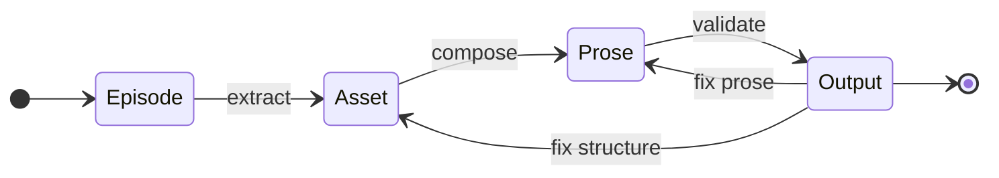

# CANONIC FSM

**4-state machine for transforming raw input into validated output.**

A domain-agnostic finite state machine that enforces traceability, governs composition, and validates compliance.

---

## The Machine



**Four states. Three transitions. One validation gate.**

- **Episodes** — Raw domain input (ungoverned)
- **Assets** — Registered entities (governed, immutable)
- **Prose** — Composed content (governed, mutable)
- **Output** — Validated artifacts (governed, immutable)

---

## How It Works

### 1. Episodes (Input)

Human-sourced material enters the system:
- **Writing:** lived experiences, observations, memories
- **Documentation:** requirements, specifications, notes
- **Research:** observations, data collection, field notes
- **Knowledge:** notes, highlights, learnings

Episodes are ungoverned. Contradictions, incompleteness, messiness allowed.

### 2. Assets (Structure)

Entities extracted from episodes and registered:
- **Writing:** persons, places, events, claims
- **Documentation:** API endpoints, components, modules
- **Research:** variables, measurements, subjects
- **Knowledge:** concepts, definitions, sources

Assets get stable IDs. Source traceability enforced. Ledger is single source of truth.

### 3. Prose (Composition)

Content composed using registered assets:
- **Writing:** narrative referencing characters, places, events
- **Documentation:** explanations referencing API entities
- **Research:** analysis referencing data entities
- **Knowledge:** summaries referencing concepts

Prose may only reference registered assets. Unregistered references violate.

### 4. Output (Validation)

Final artifacts exist only when compliant:
- **Writing:** published prose with full traceability
- **Documentation:** API docs with validated references
- **Research:** papers with traceable claims
- **Knowledge:** wiki pages with source attribution

Validation gate blocks non-compliant output. Fix upstream, never downstream.

---

## What This Enforces

**Traceability:**
- Every asset traces to source episode
- Every prose reference traces to registered asset
- Claims cannot be invented without documented origin

**Immutability:**
- Episodes freeze after extraction
- Asset IDs never change
- Output is immutable once generated

**Consistency:**
- Prose cannot reference unregistered entities
- Structure changes require coordinated updates (REINDEX)
- Validation blocks invalid transitions

---

## Domain Examples

### Writing Application

See [canonic-machine/writing](https://github.com/canonic-machine/writing) for complete implementation.

**Episodes:** Lived experiences, observations, memories
**Assets:** Characters, places, objects, claims, events
**Prose:** Narrative text referencing assets
**Output:** Published work with full traceability

### Documentation System

**Episodes:** Requirements, specs, stakeholder notes
**Assets:** API endpoints, components, data models
**Prose:** API documentation referencing entities
**Output:** Published docs with validated references

### Research Pipeline

**Episodes:** Observations, raw data, field notes
**Assets:** Variables, measurements, subjects, methods
**Prose:** Analysis and results referencing data
**Output:** Papers with traceable claims

---

## Quick Start

See [00-MACHINE.md](00-MACHINE.md) for complete FSM definition.

**Minimal implementation:**

```
project/
├── episodes/          # Raw input
│   ├── CANON.md
│   ├── VOCABULARY.md
│   ├── README.md
│   └── 001-*.md
├── assets/            # Registered entities
│   ├── CANON.md
│   ├── VOCABULARY.md
│   ├── README.md
│   └── LEDGER.md
├── prose/             # Composed content
│   ├── CANON.md
│   ├── VOCABULARY.md
│   ├── README.md
│   └── draft.md
└── output/            # Validated artifacts
    ├── CANON.md
    ├── VOCABULARY.md
    ├── README.md
    └── METADATA.md
```

Each directory has the triad (CANON, VOCABULARY, README). Each state has constraints.

---

## Core Protocols

The FSM applies CANONIC protocols from [canonic-machine/canonic](https://github.com/canonic-machine/canonic):

- **reindexable_artifact_pattern** for episodes
- **ledger_pattern** for assets
- **fsm_state_pattern** for prose and output
- **immutability_protocol** for IDs and sources
- **traceability_protocol** for references
- **validation_protocol** for compliance gates

See [CANON.md](CANON.md) for FSM-specific constraints.

---

## What Makes It Different

**Traditional systems:**
- No enforcement between thinking and output
- Structure and content blur
- Revision destroys traceability
- AI generates slop without validation

**CANONIC FSM:**
- Separation of concerns (episodes vs assets vs prose)
- Structural foundation before composition
- Traceability enforced by validation
- AI accelerates, validation blocks slop

---

## Applications

The FSM works for any domain where traceability matters:

- **Writing** — Books, articles, documentation
- **Documentation** — API docs, technical specs, user guides
- **Research** — Papers, analyses, reproducible claims
- **Knowledge management** — Wikis, knowledge bases, structured notes
- **Requirements** — Product specs, feature docs, acceptance criteria

If you need to track where things came from, this FSM enforces it.

---

## Contributing

Issues and PRs welcome. When adding features, maintain:
- Domain-agnostic design
- Protocol-based constraints
- The 4-state structure

---

## License

MIT — See [LICENSE](LICENSE)

---

## Governance Chain

- **This CANON:** FSM-level constraints (4-state structure, transitions, validation)
- **Inherits from:** [canonic-machine/canonic](https://github.com/canonic-machine/canonic) (protocols, patterns, triad)
- **Used by:** Domain applications (writing, docs, research)

---

## System Maturity

This implementation repository is in **active learning phase** (52.5% producer ratio).

**Maturity thresholds (inherited from CANONIC):**
- **New system**: >40% producer commits (rapid learning phase) ← **We are here**
- **Maturing system**: 10-30% producer commits (refinement phase)
- **Mature system**: <10% producer commits (stable enforcement)

**Introspective properties (inherited from CANONIC):**
1. Self-validating: Dual validation (syntactic + semantic)
2. Self-optimizing: Lean constraints, convergence to syntactic
3. Self-documenting: Triad foundation provides complete self-description
4. Self-healing: Git patterns trigger validation responses
5. Self-measuring: Producer/consumer ratios track maturity
6. Self-strengthening: Introspection cycles canonify discoveries

**Recent discoveries (see [04-LEARNINGS.md](04-LEARNINGS.md)):**

### File Organization Pattern
The triad (CANON, VOCABULARY, README) are unnumbered primitives that form the self-describing foundation. Numbered stack layers (00-SPEC, 01+) build on top of this foundation:

```
CANON.md           (primitive: governance constraints)
VOCABULARY.md      (primitive: terminology)
README.md          (primitive: human entry point)
00-MACHINE.md      (spec: FSM architecture definition)
01-AGENTS.md       (layer: agent patterns)
02-PROTOCOLS.md    (layer: reusable protocols)
03-WORKFLOWS.md    (layer: orchestrated sequences)
04-LEARNINGS.md    (layer: discoveries and evolution)
```

### Compositional Nomenclature
File names compose naturally: "canonic [domain] [engine] [output] [component]"
- Base: "canonic writing machine"
- Extended: "canonic writing machine workflows"
- Component files (AGENTS, PROTOCOLS, WORKFLOWS, LEARNINGS) scale universally

### Producer-Before-Consumer Discipline
This repository consumes patterns canonified in the governance repository:
1. Governance repo canonifies pattern (producer commit)
2. Implementation repo applies pattern (consumer commit)
3. Implementation repo captures learning (introspection commit)

This ordering ensures governance leads implementation.

### Introspection Cycle
The system strengthens through:
- Work reveals gaps → Introspection asks "why?" → Learning captured → Pattern canonified → System improves

**Current state:** 11 learnings documented, 100% canonified into governance constraints.

---

End README.
