# CANON Template

```mermaid
graph TD
    A["{{NAME}} ({{scope path}})"] --> C["inherits: {{parent scope path}}"]
    C --> D["axioms"]
    D --> D1["1. triad: {{description}}"]
    D --> D2["2. inheritance: {{parent link explanation, inherited axioms are final}}"]
    D --> D3["3. coherence: {{semantic expectations}}"]
    D --> D4["4. compliance: {{structural requirements}}"]
    D --> D5["5. governance: {{coherence ∧ compliance}}"]
    D --> D6["6. invalidity: {{invalid scope description}}"]
    D --> D7["7. introspection: {{self-documentation loop}}"]
    D --> D8["optional (machine-only). correction: {{history-preserving remedy}}"]
    D --> D9["optional (machine-only). ordering: {{required ordering enforcement}}"]
```

Use this blueprint for any CANON scope. Replace placeholders with statements specific to the scope you are governing. For the root CANON, set `<NAME>` to the repository name and keep `inherits: /`. Inherited axioms are final. Machine scopes extend the base axioms with correction and ordering.

